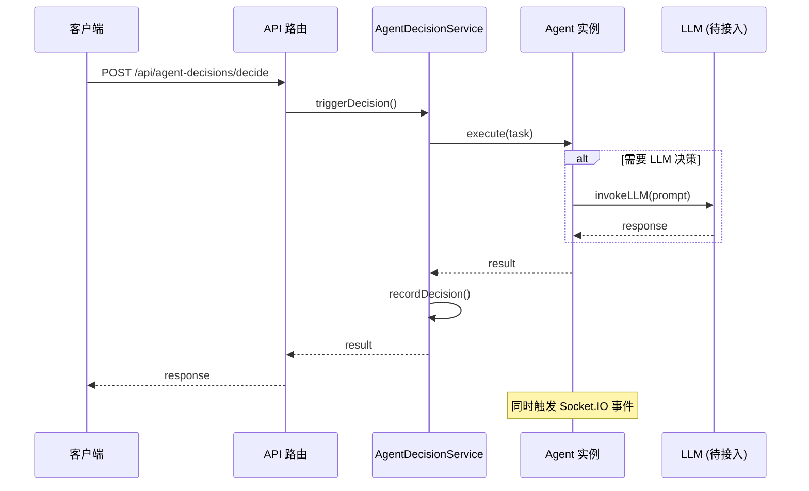

# 后端 API 完整实现指南

> 3D 打印多 Agent 系统 - API 集成文档  
> 创建时间：2026-03-06  
> 状态：✅ 核心功能已完成，⏳ 待接入 LLM

---

## 📋 目录

1. [现有 API 总览](#现有 api 总览)
2. [Agent 系统架构](#agent 系统架构)
3. [Socket.IO 实时推送](#socketio-实时推送)
4. [LLM 集成方案](#llm 集成方案)
5. [API 使用示例](#api 使用示例)
6. [下一步行动](#下一步行动)

---

## 🎯 现有 API 总览

### ✅ 已完成的 API

| 路由 | 端点 | 功能 | 状态 |
|------|------|------|------|
| **Agent 决策** | `/api/agent-decisions/*` | 决策记录与查询 | ✅ 完成 |
| **Agents** | `/api/agents/*` | Agent 直接调用 | ✅ 完成 |
| **订单** | `/api/orders/*` | 订单 CRUD | ✅ 完成 |
| **设备** | `/api/devices/*` | 设备管理 | ✅ 完成 |
| **材料** | `/api/materials/*` | 材料管理 | ✅ 完成 |
| **仪表盘** | `/api/dashboard/*` | 统计数据 | ✅ 完成 |

### 📁 Agent 决策 API 详细端点

```javascript
// 触发 Agent 决策
POST   /api/agent-decisions/decide
{
  "agentType": "coordinator|scheduler|inventory",
  "action": "review_order|schedule_device|check_inventory",
  "data": { "orderId": "...", ... }
}

// 查询订单决策历史
GET    /api/agent-decisions/order/:orderId

// 查询 Agent 决策记录
GET    /api/agent-decisions/agent/:agentId

// 获取决策详情
GET    /api/agent-decisions/:decisionId

// 获取决策解释
GET    /api/agent-decisions/:decisionId/explanation

// 获取低置信度决策
GET    /api/agent-decisions/low-confidence

// 获取决策统计
GET    /api/agent-decisions/stats

// 批量记录决策
POST   /api/agent-decisions/batch-record

// Agent 状态接口
GET    /api/agent-decisions/coordinator/status
POST   /api/agent-decisions/coordinator/review
POST   /api/agent-decisions/scheduler/allocate
POST   /api/agent-decisions/inventory/check
```

### 📁 Agents API 详细端点

```javascript
// 记录 Agent 决策
POST   /api/agents/decide

// 获取订单决策历史
GET    /api/agents/decisions/:orderId

// 获取 Agent 状态
GET    /api/agents/status

// 触发协调 Agent 决策
POST   /api/agents/coordinator/decision

// 设备分配
POST   /api/agents/schedule
GET    /api/agents/schedule/:orderId
GET    /api/agents/devices/available
POST   /api/agents/schedule/batch
GET    /api/agents/scheduler/status

// 协调状态查询
GET    /api/agents/coordination/:orderId
GET    /api/agents/coordinator/status
POST   /api/agents/coordinator/decision

// 库存 Agent
POST   /api/agents/inventory/check
GET    /api/agents/inventory/forecast
GET    /api/agents/inventory/reorder-suggestions
GET    /api/agents/inventory/low-stock
POST   /api/agents/inventory/compatibility
GET    /api/agents/inventory/status
```

---

## 🤖 Agent 系统架构

### Agent 层次结构

```
AgentRegistry (单例)
├── CoordinatorAgent (协调 Agent)
│   ├── DecisionEngine (决策引擎)
│   ├── AgentMessenger (通信模块)
│   └── tools/*
├── SchedulerAgent (调度 Agent)
│   ├── DeviceAllocationAlgorithm (分配算法)
│   └── SchedulingRuleManager (规则管理器)
└── InventoryAgent (库存 Agent)
    ├── InventoryForecastAlgorithm (预测算法)
    └── InventoryRuleManager (规则管理器)
```

### Agent 决策流程



### Agent 状态机

```javascript
AgentState = {
  IDLE: 'idle',           // 空闲
  INITIALIZING: 'initializing',  // 初始化中
  READY: 'ready',         // 就绪
  BUSY: 'busy',          // 忙碌
  ERROR: 'error',        // 错误
  SHUTDOWN: 'shutdown'   // 已关闭
}
```

---

## 🔌 Socket.IO 实时推送

### ✅ 已实现的事件类型

| 事件名称 | 方向 | 说明 |
|---------|------|------|
| `agent-event` | Server → Client | Agent 决策事件 |
| `agent-state-change` | Server → Client | Agent 状态变化 |
| `agent-tool-start` | Server → Client | 工具调用开始 |
| `agent-tool-complete` | Server → Client | 工具调用完成 |
| `decision_low_confidence` | Server → Client | 低置信度告警 |

### 前端连接示例

```typescript
// frontend/src/services/agentService.ts
import { io, Socket } from 'socket.io-client';

class AgentSocketService {
  private socket: Socket | null = null;
  
  connect() {
    this.socket = io(process.env.BACKEND_URL || 'http://localhost:3001', {
      path: '/socket.io',
      transports: ['websocket'],
    });
    
    this.socket.on('connect', () => {
      console.log('Socket.IO connected');
    });
    
    this.socket.on('agent-event', (event: AgentEvent) => {
      console.log('Agent event:', event);
    });
    
    this.socket.on('agent-state-change', (event: any) => {
      console.log('Agent state changed:', event);
    });
  }
  
  disconnect() {
    this.socket?.disconnect();
  }
}
```

---

## 🧠 LLM 集成方案

### 当前状态

`backend/src/config/llm.js` 已支持：
- ✅ OpenAI (ChatOpenAI)
- ✅ Claude (ChatAnthropic)
- ✅ 本地模型 (兼容 OpenAI 接口)

### 待接入：智谱 AI GLM-4

#### 步骤 1：安装 SDK

```bash
cd backend
npm install zhipuai
```

#### 步骤 2：修改 config/llm.js

```javascript
const { ChatOpenAI } = require('@langchain/openai');
const { ZhipuAI } = require('zhipuai');

// 添加智谱 AI 提供商
const LLMProvider = {
  OPENAI: 'openai',
  CLAUDE: 'claude',
  ZHIPU: 'zhipu',  // 新增
  LOCAL: 'local'
};

// 在 createLLM 中添加智谱 AI case
case LLMProvider.ZHIPU:
  return createZhipu(config);

function createZhipu(config) {
  // 方案 1: 使用 LangChain (如果支持)
  // 方案 2: 使用原生 SDK 并包装成 LangChain 接口
  const client = new ZhipuAI({
    apiKey: config.apiKey,
    model: config.model
  });
  
  // 包装成 LangChain 兼容接口
  return {
    invoke: async (messages) => {
      const response = await client.chat.completions.create({
        model: config.model,
        messages: Array.isArray(messages) ? messages : [{ role: 'user', content: messages }]
      });
      return { content: response.choices[0].message.content };
    }
  };
}
```

#### 步骤 3：更新 .env

```bash
# .env
LLM_PROVIDER=zhipu
ZHIPU_API_KEY=your_api_key_here
ZHIPU_MODEL=glm-4-flash
```

### LLM 调用位置

Agent 决策中 LLM 调用点：

1. **CoordinatorAgent.makeDecision()**
   - 订单审核决策
   - 路由决策

2. **SchedulerAgent.allocateDevice()**
   - 设备评分（可选项，目前用算法）

3. **InventoryAgent.checkInventory()**
   - 库存状态判断（可选项，目前用规则）

---

## 📚 API 使用示例

### 示例 1：触发协调 Agent 决策

```bash
curl -X POST http://localhost:3001/api/agent-decisions/coordinator/review \
  -H "Content-Type: application/json" \
  -d '{
    "orderId": "65f1234567890abcdef12345",
    "context": {
      "priority": "normal"
    }
  }'
```

**响应：**
```json
{
  "success": true,
  "data": {
    "decisionId": "dec_1234567890",
    "agentId": "coordinator_agent",
    "decisionType": "scheduling",
    "decisionResult": "auto_approve",
    "confidence": 0.95,
    "rationale": "订单参数正常，自动通过审核",
    "alternatives": [],
    "timestamp": "2026-03-06T10:00:00.000Z"
  }
}
```

### 示例 2：查询订单决策历史

```bash
curl http://localhost:3001/api/agent-decisions/order/65f1234567890abcdef12345
```

**响应：**
```json
{
  "success": true,
  "data": {
    "orderId": "65f1234567890abcdef12345",
    "decisions": [
      {
        "_id": "dec_123",
        "agentId": "coordinator_agent",
        "decisionType": "scheduling",
        "decisionResult": "auto_approve",
        "confidence": 0.95,
        "rationale": "订单参数正常",
        "createdAt": "2026-03-06T10:00:00.000Z"
      },
      {
        "_id": "dec_456",
        "agentId": "scheduler_agent",
        "decisionType": "device_selection",
        "decisionResult": "printer_a",
        "confidence": 0.88,
        "rationale": "设备评分最高",
        "createdAt": "2026-03-06T10:00:05.000Z"
      }
    ]
  }
}
```

### 示例 3：Socket.IO 实时监听

```typescript
// 前端代码
const socket = io('http://localhost:3001');

socket.on('agent-event', (event) => {
  console.log('收到 Agent 事件:', {
    agent: event.agent,
    decision: event.decision,
    orderId: event.orderId
  });
  
  // 更新 UI
  setEvents(prev => [event, ...prev]);
});

socket.on('agent-state-change', (event) => {
  console.log('Agent 状态变化:', {
    agentId: event.agentId,
    previousState: event.previousState,
    currentState: event.currentState
  });
  
  // 更新 Agent 节点状态
  setAgentStates(prev => ({
    ...prev,
    [event.agentId]: { status: event.currentState }
  }));
});
```

---

## 🎬 下一步行动

### 阶段 1：Socket.IO 集成（✅ 已完成）

- [x] 安装 `socket.io` 包
- [x] 修改 `app.js` 添加 Socket.IO 服务器
- [x] 配置事件转发机制
- [ ] 测试 Socket.IO 连接

### 阶段 2：Agent Profile API（⏳ 进行中）

- [ ] 新增 `/api/agents/profile/:agentId` 端点
- [ ] 返回 `systemPrompt`、`memory`、`tokenUsage` 等字段
- [ ] 支持动态更新 Agent 配置

### 阶段 3：智谱 AI 集成（⏳ 待开始）

- [ ] 安装 `zhipuai` SDK
- [ ] 修改 `config/llm.js` 支持智谱 AI
- [ ] 更新 `.env` 添加智谱 AI 配置
- [ ] 测试 LLM 连接
- [ ] 集成到 Agent 决策流程

### 阶段 4：前后端对接（⏳ 待开始）

- [ ] 修改前端 `agentService.ts` 调用真实 API
- [ ] 替换模拟数据为 Socket.IO 实时事件
- [ ] 测试端到端流程

---

## 📖 相关文档

- [AgentDecision Model](../src/models/AgentDecision.js)
- [AgentDecisionService](../src/services/AgentDecisionService.js)
- [CoordinatorAgent](../src/agents/CoordinatorAgent.js)
- [DecisionLogService](../src/services/DecisionLogService.js)
- [AgentRegistry](../src/agents/registry.js)

---

## 🆘 常见问题

### Q1: Agent 未响应决策请求？

**检查清单：**
1. Agent 是否已注册：`agentRegistry.get('coordinator_agent')`
2. Agent 状态是否为 `ready`
3. LLM 是否已正确初始化
4. 查看日志中的错误信息

### Q2: Socket.IO 连接失败？

**解决方案：**
1. 检查 CORS 配置是否允许前端域名
2. 确认防火墙未拦截 WebSocket 连接
3. 尝试使用 `transports: ['websocket', 'polling']`

### Q3: 决策记录未保存？

**检查：**
1. MongoDB 连接是否正常
2. `decisionData` 是否包含必填字段
3. 查看 DecisionLogService 的日志输出

---

**文档维护者**: AI Agent Team  
**最后更新**: 2026-03-06
