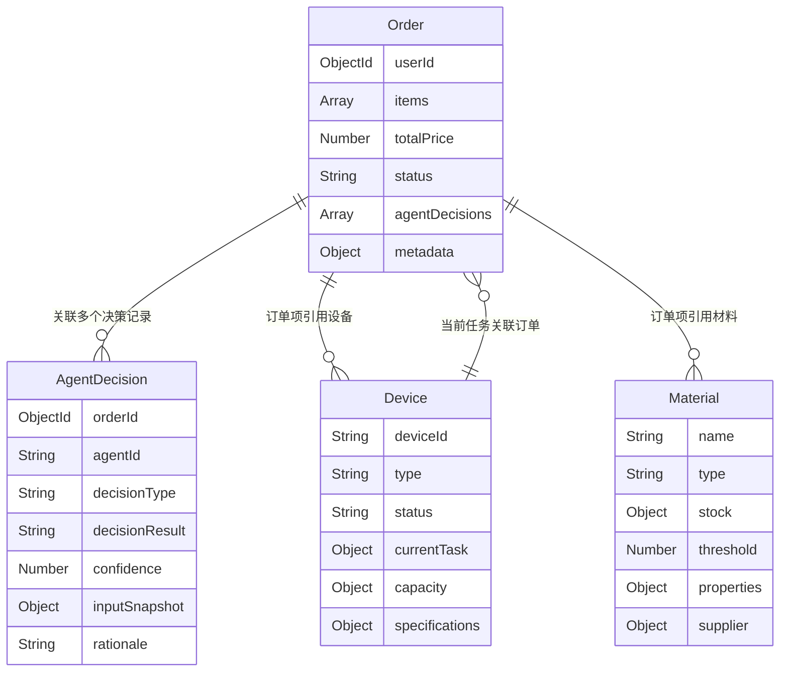

# MongoDB 数据模型指南

本文档详细介绍 3D 打印子母端多 Agent 系统的 MongoDB 数据模型设计，包括模型结构、字段说明、关系图以及使用示例。

## 目录

- [概述](#概述)
- [模型关系图](#模型关系图)
- [模型详解](#模型详解)
  - [Order（订单模型）](#order 订单模型)
  - [Device（设备模型）](#device 设备模型)
  - [Material（材料模型）](#material 材料模型)
  - [AgentDecision（Agent 决策模型）](#agentdecision-agent 决策模型)
- [使用示例](#使用示例)
- [最佳实践](#最佳实践)
- [常见问题](#常见问题)

---

## 概述

本系统采用 MongoDB 作为数据存储方案，设计了 4 个核心数据模型来支撑 3D 打印订单管理和多 Agent 决策系统：

| 模型名称 | 文件名 | 主要用途 |
|---------|--------|---------|
| **Order** | Order.js | 管理 3D 建模订单，包含订单项、价格、状态等信息 |
| **Device** | Device.js | 管理 3D 打印设备，跟踪设备状态、容量和任务分配 |
| **Material** | Material.js | 管理打印材料库存，包括材料属性、供应商信息 |
| **AgentDecision** | AgentDecision.js | 记录 AI Agent 在订单处理过程中的决策历史 |

这些模型共同构建了一个完整的 3D 打印订单处理和智能调度系统，支持从订单创建、设备分配、材料管理到 Agent 决策记录的全流程追踪。

---

## 模型关系图



### 关系说明

1. **Order → Device**: 订单的每个订单项可以引用一个设备（deviceId）
2. **Order → Material**: 订单的每个订单项可以引用一种材料（materialId）
3. **Order → AgentDecision**: 一个订单可以关联多个 Agent 决策记录
4. **Device → Order**: 设备通过 currentTask.orderId 关联当前处理的订单

---

## 模型详解

### Order（订单模型）

订单模型是整个系统的核心，代表一个完整的 3D 建模/打印订单。

#### 字段说明

| 字段名 | 类型 | 必填 | 默认值 | 说明 |
|-------|------|------|--------|------|
| `userId` | ObjectId | ✅ | - | 关联的用户 ID，引用 User 模型 |
| `items` | Array | ✅ | - | 订单项数组，每个订单项包含： |
| `items[].deviceId` | ObjectId | ✅ | - | 引用的设备 ID |
| `items[].materialId` | ObjectId | ❌ | - | 引用的材料 ID（可选） |
| `items[].quantity` | Number | ✅ | - | 数量，最小值为 1 |
| `items[].unitPrice` | Number | ✅ | - | 单价，不能为负数 |
| `items[].specifications` | Map | ❌ | - | 规格参数，键值对形式存储任意数据 |
| `totalPrice` | Number | ✅ | - | 订单总价，不能为负数 |
| `status` | String | ✅ | 'pending' | 订单状态：pending, processing, printing, completed, cancelled, failed |
| `agentDecisions` | Array | ❌ | - | 关联的 Agent 决策记录 ID 数组 |
| `metadata` | Object | ❌ | - | 元数据： |
| `metadata.sourcePhotos` | Array | ❌ | - | 源照片 URL 数组 |
| `metadata.generatedModelUrl` | String | ❌ | - | 生成的 3D 模型 URL |
| `metadata.notes` | String | ❌ | - | 备注信息 |

#### 虚拟属性

| 属性名 | 返回值 | 说明 |
|-------|--------|------|
| `itemCount` | Number | 订单项数量（items 数组长度） |

#### 实例方法

| 方法名 | 参数 | 返回值 | 说明 |
|-------|------|--------|------|
| `addAgentDecision` | decisionId: ObjectId | Promise | 将 Agent 决策记录关联到订单 |

#### 静态方法

| 方法名 | 参数 | 返回值 | 说明 |
|-------|------|--------|------|
| `findByStatus` | status: String | Promise<Array> | 根据状态查找订单，并填充设备信息 |

#### 索引

```javascript
{ status: 1, createdAt: -1 }  // 按状态和时间查询
{ userId: 1, createdAt: -1 }  // 按用户和时间查询
{ createdAt: -1 }             // 按时间倒序查询
```

---

### Device（设备模型）

设备模型用于管理 3D 打印设备，支持多种打印技术类型。

#### 字段说明

| 字段名 | 类型 | 必填 | 默认值 | 说明 |
|-------|------|------|--------|------|
| `deviceId` | String | ✅ | - | 设备唯一标识符，全局唯一 |
| `type` | String | ✅ | - | 设备类型：sla（光固化）, fdm（熔融沉积）, sls（激光烧结）, mjf（多射流熔融） |
| `status` | String | ✅ | 'idle' | 设备状态：idle（空闲）, busy（忙碌）, maintenance（维护中）, offline（离线） |
| `currentTask` | Object | ❌ | - | 当前任务信息： |
| `currentTask.orderId` | ObjectId | ❌ | - | 关联的订单 ID |
| `currentTask.startedAt` | Date | ❌ | - | 任务开始时间 |
| `currentTask.estimatedCompletion` | Date | ❌ | - | 预计完成时间 |
| `capacity` | Object | ❌ | - | 容量信息： |
| `capacity.maxVolume` | Number | ❌ | 100 | 最大容量（百分比） |
| `capacity.currentLoad` | Number | ❌ | 0 | 当前负载（0-100%） |
| `specifications` | Object | ❌ | - | 设备规格： |
| `specifications.buildVolume` | Object | ❌ | - | 构建体积：{x, y, z} |
| `specifications.resolution` | String | ❌ | - | 分辨率 |
| `specifications.supportedMaterials` | Array | ❌ | - | 支持的材料列表 |
| `location` | String | ❌ | - | 设备位置 |

#### 实例方法

| 方法名 | 参数 | 返回值 | 说明 |
|-------|------|--------|------|
| `assignTask` | orderId: ObjectId, estimatedCompletion: Date | Promise | 分配任务到设备 |
| `completeTask` | - | Promise | 完成当前任务，重置设备状态 |

#### 静态方法

| 方法名 | 参数 | 返回值 | 说明 |
|-------|------|--------|------|
| `findAvailable` | type: String (可选) | Promise<Array> | 查找可用设备，按负载升序排序 |

#### 索引

```javascript
{ deviceId: 1 }              // 设备 ID 精确查询
{ status: 1 }                // 按状态查询
{ type: 1, status: 1 }       // 按类型和状态组合查询
```

---

### Material（材料模型）

材料模型用于管理 3D 打印材料库存和属性。

#### 字段说明

| 字段名 | 类型 | 必填 | 默认值 | 说明 |
|-------|------|------|--------|------|
| `name` | String | ✅ | - | 材料名称 |
| `type` | String | ✅ | - | 材料类型：resin（树脂）, filament（线材）, powder（粉末）, liquid（液体） |
| `stock` | Object | ✅ | - | 库存信息： |
| `stock.quantity` | Number | ✅ | 0 | 库存数量 |
| `stock.unit` | String | ✅ | 'kg' | 单位：kg, g, L, mL, spool, cartridge |
| `threshold` | Number | ✅ | 10 | 补货阈值，低于此值需要补货 |
| `properties` | Object | ❌ | - | 材料属性： |
| `properties.color` | String | ❌ | - | 颜色 |
| `properties.density` | Number | ❌ | - | 密度 |
| `properties.tensileStrength` | String | ❌ | - | 抗拉强度 |
| `properties.printTemperature` | Object | ❌ | - | 打印温度：{min, max} |
| `supplier` | Object | ❌ | - | 供应商信息： |
| `supplier.name` | String | ❌ | - | 供应商名称 |
| `supplier.contactInfo` | String | ❌ | - | 联系方式 |
| `supplier.sku` | String | ❌ | - | 供应商 SKU |
| `costPerUnit` | Number | ✅ | - | 单位成本 |

#### 虚拟属性

| 属性名 | 返回值 | 说明 |
|-------|--------|------|
| `needsReorder` | Boolean | 是否需要补货（库存 ≤ 阈值） |

#### 实例方法

| 方法名 | 参数 | 返回值 | 说明 |
|-------|------|--------|------|
| `updateStock` | quantityChange: Number | Promise | 更新库存数量，会自动检查库存是否充足 |

#### 静态方法

| 方法名 | 参数 | 返回值 | 说明 |
|-------|------|--------|------|
| `findLowStock` | - | Promise<Array> | 查找库存不足的材料 |

#### 索引

```javascript
{ type: 1 }                  // 按材料类型查询
{ name: 1 }                  // 按材料名称查询
{ 'stock.quantity': 1 }      // 按库存数量查询
```

---

### AgentDecision（Agent 决策模型）

Agent 决策模型用于记录 AI Agent 在订单处理过程中的决策历史，支持决策追溯和分析。

#### 字段说明

| 字段名 | 类型 | 必填 | 默认值 | 说明 |
|-------|------|------|--------|------|
| `orderId` | ObjectId | ✅ | - | 关联的订单 ID |
| `agentId` | String | ✅ | - | Agent 唯一标识符 |
| `decisionType` | String | ✅ | - | 决策类型：device_selection, material_selection, print_parameter, quality_check, error_recovery, scheduling |
| `decisionResult` | String | ✅ | - | 决策结果 |
| `confidence` | Number | ✅ | 0.5 | 置信度（0-1 之间） |
| `inputSnapshot` | Map | ✅ | - | 输入快照，记录决策时的输入数据 |
| `rationale` | String | ✅ | - | 决策理由说明 |
| `alternatives` | Array | ❌ | - | 备选方案列表： |
| `alternatives[].option` | String | ❌ | - | 备选方案描述 |
| `alternatives[].score` | Number | ❌ | - | 评分 |
| `alternatives[].reason` | String | ❌ | - | 评分理由 |
| `impact` | Object | ❌ | - | 影响评估： |
| `impact.estimatedTime` | Number | ❌ | - | 预计时间影响 |
| `impact.estimatedCost` | Number | ❌ | - | 预计成本影响 |
| `impact.qualityScore` | Number | ❌ | - | 质量评分 |

#### 实例方法

| 方法名 | 参数 | 返回值 | 说明 |
|-------|------|--------|------|
| `linkToOrder` | - | Promise | 将决策记录关联到订单（自动调用 Order.addAgentDecision） |

#### 静态方法

| 方法名 | 参数 | 返回值 | 说明 |
|-------|------|--------|------|
| `findByOrder` | orderId: ObjectId | Promise<Array> | 查找订单的所有决策记录，按时间倒序 |
| `findLowConfidence` | threshold: Number (默认 0.5) | Promise<Array> | 查找低置信度决策，用于人工审核 |

#### 索引

```javascript
{ orderId: 1, createdAt: -1 }     // 按订单和时间查询
{ agentId: 1, decisionType: 1 }   // 按 Agent 和决策类型查询
{ decisionType: 1 }               // 按决策类型查询
{ createdAt: -1 }                 // 按时间倒序查询
```

---

## 使用示例

### 创建订单

```javascript
const { Order, Device, Material } = require('./models');

// 创建新订单
async function createOrder() {
  const order = new Order({
    userId: '64f1234567890abcdef12345',
    items: [
      {
        deviceId: '64f1234567890abcdef67890',
        materialId: '64f1234567890abcdef11111',
        quantity: 2,
        unitPrice: 150.00,
        specifications: {
          color: 'white',
          infill: '20%',
          layerHeight: '0.2mm'
        }
      }
    ],
    totalPrice: 300.00,
    status: 'pending',
    metadata: {
      sourcePhotos: ['https://example.com/photo1.jpg'],
      notes: '紧急订单'
    }
  });

  await order.save();
  console.log('订单创建成功:', order._id);
  return order;
}
```

### 查找可用设备并分配任务

```javascript
const { Device } = require('./models');

// 查找可用的 SLA 类型设备
async function assignDevice(orderId, estimatedTime) {
  // 查找空闲的 SLA 设备
  const device = await Device.findAvailable('sla');
  
  if (!device || device.length === 0) {
    throw new Error('暂无可用设备');
  }

  // 分配任务给第一个可用设备
  await device[0].assignTask(orderId, estimatedTime);
  console.log('任务已分配到设备:', device[0].deviceId);
  return device[0];
}
```

### 更新材料库存

```javascript
const { Material } = require('./models');

// 消耗材料
async function consumeMaterial(materialId, quantity) {
  const material = await Material.findById(materialId);
  
  if (!material) {
    throw new Error('材料不存在');
  }

  try {
    await material.updateStock(-quantity); // 负数表示消耗
    console.log('库存已更新，当前库存:', material.stock.quantity);
    
    // 检查是否需要补货
    if (material.needsReorder) {
      console.log('警告：库存不足，需要补货!');
    }
  } catch (error) {
    console.error('库存更新失败:', error.message);
    throw error;
  }
}

// 补充材料
async function restockMaterial(materialId, quantity) {
  const material = await Material.findById(materialId);
  await material.updateStock(quantity); // 正数表示补充
}
```

### 记录 Agent 决策

```javascript
const { AgentDecision, Order } = require('./models');

// 记录设备选择决策
async function recordDeviceSelection(orderId, agentId, selectedDevice, alternatives) {
  const decision = new AgentDecision({
    orderId,
    agentId,
    decisionType: 'device_selection',
    decisionResult: `选择设备：${selectedDevice.deviceId}`,
    confidence: 0.92,
    inputSnapshot: {
      orderSize: 'medium',
      materialType: 'resin',
      urgency: 'high'
    },
    rationale: '根据订单尺寸和紧急程度，选择当前负载最低的设备',
    alternatives: alternatives.map(alt => ({
      option: alt.deviceId,
      score: alt.score,
      reason: alt.reason
    })),
    impact: {
      estimatedTime: 120, // 分钟
      estimatedCost: 150, // 元
      qualityScore: 0.95
    }
  });

  // 保存决策并关联到订单
  await decision.save();
  await decision.linkToOrder();
  
  console.log('Agent 决策已记录:', decision._id);
  return decision;
}

// 查找订单的所有决策记录
async function getOrderDecisions(orderId) {
  const decisions = await AgentDecision.findByOrder(orderId);
  console.log('找到', decisions.length, '条决策记录');
  return decisions;
}

// 查找低置信度决策（需要人工审核）
async function reviewLowConfidenceDecisions() {
  const lowConfidence = await AgentDecision.findLowConfidence(0.6);
  console.log('需要审核的决策数量:', lowConfidence.length);
  return lowConfidence;
}
```

### 查询订单状态

```javascript
const { Order } = require('./models');

// 按状态查询订单
async function getOrdersByStatus(status) {
  const orders = await Order.findByStatus(status);
  return orders;
}

// 查询用户的订单历史
async function getUserOrderHistory(userId) {
  const orders = await Order.find({ userId })
    .sort({ createdAt: -1 })
    .populate('items.deviceId')
    .populate('items.materialId')
    .populate('agentDecisions');
  
  return orders;
}

// 查询订单详情（填充关联数据）
async function getOrderDetails(orderId) {
  const order = await Order.findById(orderId)
    .populate('items.deviceId')
    .populate('items.materialId')
    .populate('agentDecisions');
  
  console.log('订单项数:', order.itemCount); // 使用虚拟属性
  return order;
}
```

---

## 最佳实践

### 1. 索引使用建议

- **查询频繁的字段必须建立索引**：如 `status`、`userId`、`createdAt`
- **组合索引注意字段顺序**：将选择性高的字段放在前面
- **定期分析索引使用情况**：使用 MongoDB 的 `explain()` 分析查询性能
- **避免过度索引**：每个索引都会增加写入开销

```javascript
// 推荐：为常用查询模式建立组合索引
orderSchema.index({ userId: 1, status: 1, createdAt: -1 });

// 使用 explain 分析查询
const explainPlan = await Order.find({ status: 'pending' })
  .explain('executionStats');
console.log(explainPlan.executionStats);
```

### 2. 查询优化技巧

- **使用投影限制返回字段**：只查询需要的字段
- **合理使用 populate**：避免过度填充关联数据
- **使用分页处理大数据集**：避免一次性加载过多数据

```javascript
// 只查询需要的字段
const orders = await Order.find({ status: 'pending' })
  .select('_id userId totalPrice status createdAt')
  .limit(20)
  .skip(0);

// 按需 populate
const order = await Order.findById(orderId)
  .populate('items.deviceId', 'deviceId type status') // 只填充部分字段
  .populate('agentDecisions', 'decisionType decisionResult confidence');
```

### 3. 事务处理注意事项

```javascript
const mongoose = require('mongoose');

// 使用事务确保数据一致性
async function processOrder(orderId, deviceId) {
  const session = await mongoose.startSession();
  session.startTransaction();

  try {
    // 更新订单状态
    await Order.findByIdAndUpdate(
      orderId,
      { status: 'processing' },
      { session }
    );

    // 分配设备任务
    await Device.findByIdAndUpdate(
      deviceId,
      { 
        status: 'busy',
        'currentTask.orderId': orderId
      },
      { session }
    );

    // 提交事务
    await session.commitTransaction();
  } catch (error) {
    // 回滚事务
    await session.abortTransaction();
    throw error;
  } finally {
    session.endSession();
  }
}
```

### 4. 数据验证建议

- **利用 Mongoose 内置验证**：如 `required`、`min`、`max`、`enum`
- **自定义验证函数**：处理复杂业务规则
- **错误处理统一格式**：返回友好的错误信息

```javascript
// 自定义验证
orderSchema.path('items').validate(function(items) {
  const totalItems = items.reduce((sum, item) => sum + item.quantity, 0);
  return totalItems > 0;
}, '订单必须至少包含一个商品');
```

### 5. Agent 决策追踪建议

- **记录完整输入快照**：便于后续分析和复现
- **保存备选方案**：理解决策过程的权衡
- **定期审核低置信度决策**：优化 Agent 模型

```javascript
// 定期导出决策数据进行分析
async function exportDecisionsForAnalysis(startDate, endDate) {
  const decisions = await AgentDecision.find({
    createdAt: { $gte: startDate, $lte: endDate }
  })
  .populate('orderId', 'status totalPrice')
  .sort({ createdAt: -1 });

  // 导出为 CSV 或发送到数据分析平台
  return decisions;
}
```

---

## 常见问题

### Q1: 如何处理订单状态流转？

**A**: 使用预定义的状态枚举确保状态合法性：

```javascript
// 推荐的状态流转
pending → processing → printing → completed
                    ↓
              cancelled / failed

// 更新状态时验证
order.status = 'processing'; // ✅ 合法
order.status = 'unknown';    // ❌ 会触发验证错误
```

### Q2: 如何并发安全地更新设备状态？

**A**: 使用乐观锁或事务：

```javascript
// 方法 1: 使用 versionKey
const device = await Device.findById(deviceId);
if (device.status === 'idle') {
  await device.assignTask(orderId, estimatedTime);
}

// 方法 2: 使用 findOneAndUpdate 原子操作
await Device.findOneAndUpdate(
  { _id: deviceId, status: 'idle' }, // 条件中包含状态检查
  { status: 'busy', /* ... */ }
);
```

### Q3: 如何高效查询低库存材料？

**A**: 使用虚拟属性和预建索引：

```javascript
// 直接查询需要补货的材料
const lowStockMaterials = await Material.findLowStock();

// 或者自定义查询
const threshold = 10;
const materials = await Material.find({
  'stock.quantity': { $lte: threshold }
});
```

### Q4: Agent 决策记录是否会无限增长？

**A**: 建议实施数据归档策略：

```javascript
// 定期归档旧决策（如超过 90 天）
async function archiveOldDecisions(days = 90) {
  const cutoffDate = new Date();
  cutoffDate.setDate(cutoffDate.getDate() - days);

  const result = await AgentDecision.updateMany(
    { createdAt: { $lt: cutoffDate }, archived: { $ne: true } },
    { $set: { archived: true } }
  );

  console.log('已归档', result.modifiedCount, '条决策记录');
}
```

### Q5: 如何处理订单项中的动态规格参数？

**A**: 使用 Map 类型存储灵活数据：

```javascript
// 添加规格参数
order.items[0].specifications.set('color', 'white');
order.items[0].specifications.set('infill', '20%');
await order.save();

// 读取规格参数
const color = order.items[0].specifications.get('color');

// 转换为普通对象
const specsObj = Object.fromEntries(order.items[0].specifications);
```

---

## 附录

### 模型文件位置

```
backend/src/models/
├── Order.js           # 订单模型
├── Device.js          # 设备模型
├── Material.js        # 材料模型
├── AgentDecision.js   # Agent 决策模型
└── index.js           # 模型导出索引
```

### 相关文档

- [数据库连接配置](../src/db/connect.js)
- [API 路由文档](../src/routes/)
- [项目 README](../README.md)

---

**文档版本**: v1.0.0  
**最后更新**: 2026-03-03  
**维护者**: 3D 打印多 Agent 系统团队
